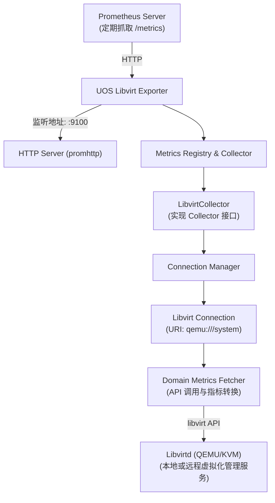

# UOS Libvirt Exporter - High-Level Design (HLD)

## 1. 架构概述

### 1.1 系统架构

UOS Libvirt Exporter 是一个单进程守护程序，采用以下架构模式：



### 1.2 核心组件

1. **HTTP Server**: 基于 `prometheus/client_golang/promhttp`，提供 `/metrics` 端点
2. **LibvirtCollector**: 核心采集器，实现 `prometheus.Collector` 接口
3. **Connection Manager**: 管理 libvirt 连接，处理重连逻辑
4. **Domain Metrics Fetcher**: 封装 libvirt API 调用，获取虚拟机指标

## 2. 指标设计

### 2.1 虚拟机状态指标

| 指标名称 | 类型 | 标签 | 描述 |
|---------|------|------|------|
| `libvirt_domain_state` | Gauge | `domain`, `uuid`, `hypervisor` | 虚拟机状态码 (0=无状态, 1=运行中, 2=阻塞, 3=暂停, 4=关机中, 5=关机, 6=崩溃, 7=暂停崩溃) |
| `libvirt_domain_state_info` | Gauge | `domain`, `uuid`, `hypervisor`, `state` | 虚拟机状态信息 (状态名称作为标签) |
| `libvirt_domain_vcpu_count` | Gauge | `domain`, `uuid`, `hypervisor` | 虚拟CPU数量 |
| `libvirt_domain_memory_max_bytes` | Gauge | `domain`, `uuid`, `hypervisor` | 虚拟机最大内存 (字节) |
| `libvirt_domain_memory_current_bytes` | Gauge | `domain`, `uuid`, `hypervisor` | 虚拟机当前内存 (字节) |
| `libvirt_domain_cpu_time_seconds_total` | Counter | `domain`, `uuid`, `hypervisor` | 虚拟机CPU使用时间 (秒) |
| `libvirt_domain_uptime_seconds` | Gauge | `domain`, `uuid`, `hypervisor` | 虚拟机运行时长 (秒) |

### 2.2 磁盘I/O指标

| 指标名称 | 类型 | 标签 | 描述 |
|---------|------|------|------|
| `libvirt_domain_disk_read_bytes_total` | Counter | `domain`, `uuid`, `disk` | 磁盘读取字节总数 |
| `libvirt_domain_disk_write_bytes_total` | Counter | `domain`, `uuid`, `disk` | 磁盘写入字节总数 |
| `libvirt_domain_disk_read_requests_total` | Counter | `domain`, `uuid`, `disk` | 磁盘读取请求总数 |
| `libvirt_domain_disk_write_requests_total` | Counter | `domain`, `uuid`, `disk` | 磁盘写入请求总数 |
| `libvirt_domain_disk_read_time_seconds_total` | Counter | `domain`, `uuid`, `disk` | 磁盘读取时间 (秒) |
| `libvirt_domain_disk_write_time_seconds_total` | Counter | `domain`, `uuid`, `disk` | 磁盘写入时间 (秒) |

### 2.3 网络I/O指标

| 指标名称 | 类型 | 标签 | 描述 |
|---------|------|------|------|
| `libvirt_domain_network_receive_bytes_total` | Counter | `domain`, `uuid`, `interface` | 网络接收字节总数 |
| `libvirt_domain_network_transmit_bytes_total` | Counter | `domain`, `uuid`, `interface` | 网络发送字节总数 |
| `libvirt_domain_network_receive_packets_total` | Counter | `domain`, `uuid`, `interface` | 网络接收数据包总数 |
| `libvirt_domain_network_transmit_packets_total` | Counter | `domain`, `uuid`, `interface` | 网络发送数据包总数 |
| `libvirt_domain_network_receive_errors_total` | Counter | `domain`, `uuid`, `interface` | 网络接收错误总数 |
| `libvirt_domain_network_transmit_errors_total` | Counter | `domain`, `uuid`, `interface` | 网络发送错误总数 |

### 2.4 元数据指标

| 指标名称 | 类型 | 标签 | 描述 |
|---------|------|------|------|
| `libvirt_exporter_build_info` | Gauge | `version`, `go_version`, `build_date` | Exporter构建信息 |
| `libvirt_connection_info` | Gauge | `uri`, `connected` | libvirt连接状态 |

## 3. 模块设计

### 3.1 核心模块结构

```
uos-libvirtd-exporter/
├── cmd/
│   └── exporter/
│       └── main.go              # 主程序入口
├── internal/
│   ├── collector/
│   │   ├── collector.go         # Collector接口定义
│   │   ├── libvirt_collector.go # Libvirt指标采集器
│   │   └── metrics.go           # 指标定义与描述
│   ├── config/
│   │   └── config.go            # 配置管理
│   ├── connection/
│   │   └── manager.go           # 连接管理器
│   └── utils/
│       └── logger.go            # 日志工具
├── go.mod                       # Go模块定义
├── go.sum                       # 依赖版本锁定
└── Makefile                     # 构建脚本
```

### 3.2 主要模块说明

#### 3.2.1 main.go

```go
// 主要功能：
// 1. 解析命令行参数和配置文件
// 2. 初始化日志系统
// 3. 创建LibvirtCollector实例
// 4. 注册指标到Prometheus Registry
// 5. 启动HTTP服务

func main() {
    // 配置加载
    config := config.Load()

    // 日志初始化
    logger.Init(config.LogLevel)

    // 创建Collector
    collector, err := collector.NewLibvirtCollector(config.LibvirtURI)
    if err != nil {
        log.Fatal(err)
    }

    // 注册Collector
    prometheus.MustRegister(collector)

    // 启动HTTP服务
    http.Handle("/metrics", promhttp.Handler())
    http.ListenAndServe(config.ListenAddress, nil)
}
```

#### 3.2.2 libvirt_collector.go

```go
// LibvirtCollector 实现prometheus.Collector接口
type LibvirtCollector struct {
    conn     *libvirt.Connect
    uri      string
    mutex    sync.RWMutex
}

// Describe 实现Collector接口
func (c *LibvirtCollector) Describe(ch chan<- *prometheus.Desc) {
    // 发送所有指标描述
}

// Collect 实现Collector接口
func (c *LibvirtCollector) Collect(ch chan<- prometheus.Metric) {
    // 采集所有指标
    c.mutex.Lock()
    defer c.mutex.Unlock()

    // 1. 检查连接状态
    if err := c.ensureConnection(); err != nil {
        // 记录连接错误指标
        return
    }

    // 2. 获取所有域
    domains, err := c.conn.ListAllDomains(libvirt.CONNECT_LIST_DOMAINS_ACTIVE | libvirt.CONNECT_LIST_DOMAINS_INACTIVE)
    if err != nil {
        return
    }
    defer func() {
        for _, domain := range domains {
            domain.Free()
        }
    }()

    // 3. 采集每个域的指标
    for _, domain := range domains {
        c.collectDomainMetrics(domain, ch)
    }
}
```

#### 3.2.3 connection/manager.go

```go
// ConnectionManager 管理libvirt连接
type ConnectionManager struct {
    uri          string
    conn         *libvirt.Connect
    reconnectCh  chan struct{}
    mutex        sync.RWMutex
}

// 连接管理功能：
// 1. 建立初始连接
// 2. 监控连接状态
// 3. 自动重连机制
// 4. 连接池管理（未来扩展）

func (m *ConnectionManager) Connect() error {
    // 建立libvirt连接
}

func (m *ConnectionManager) Reconnect() error {
    // 重新建立连接
}

func (m *ConnectionManager) IsConnected() bool {
    // 检查连接状态
}
```

## 4. 配置设计

### 4.1 命令行参数

```bash
uos-libvirtd-exporter \
  --libvirt.uri=qemu:///system \
  --web.listen-address=:9100 \
  --web.telemetry-path=/metrics \
  --log.level=info \
  --log.format=json \
  --collector.domain.stats=true \
  --collector.domain.state=true \
  --collector.disk.stats=true \
  --collector.network.stats=true
```

### 4.2 配置文件格式 (YAML)

```yaml
# config.yaml
libvirt:
  uri: "qemu:///system"
  timeout: 30s
  reconnect_interval: 60s

web:
  listen_address: ":9100"
  telemetry_path: "/metrics"

collectors:
  domain:
    stats: true
    state: true
  disk:
    stats: true
  network:
    stats: true

logging:
  level: "info"
  format: "json"
  file: "/var/log/uos-libvirtd-exporter.log"
```

## 5. 错误处理与重连机制

### 5.1 错误处理策略

1. **连接错误**: 记录错误，标记连接状态，触发重连
2. **API调用错误**: 记录错误，跳过该域的指标采集
3. **指标转换错误**: 记录错误，跳过该指标
4. **超时处理**: 设置合理的超时时间，避免阻塞

### 5.2 重连机制

```go
// 重连策略
const (
    MaxReconnectAttempts = 3
    ReconnectInterval    = 60 * time.Second
    ReconnectBackoff   = 2 * time.Second
)

func (c *LibvirtCollector) ensureConnection() error {
    if c.conn != nil && c.conn.IsAlive() {
        return nil
    }

    // 尝试重连
    for i := 0; i < MaxReconnectAttempts; i++ {
        conn, err := libvirt.NewConnect(c.uri)
        if err == nil {
            c.conn = conn
            return nil
        }

        // 指数退避
        time.Sleep(time.Duration(i+1) * ReconnectBackoff)
    }

    return fmt.Errorf("failed to reconnect after %d attempts", MaxReconnectAttempts)
}
```

## 6. 性能优化

### 6.1 采集优化

1. **批量采集**: 一次性获取所有域信息，减少API调用次数
2. **并发采集**: 对多个域的指标采集使用goroutine并发处理
3. **缓存机制**: 对不经常变化的元数据进行缓存
4. **指标过滤**: 支持按需采集，减少不必要的计算

### 6.2 内存管理

1. **及时释放**: 及时释放libvirt对象，避免内存泄漏
2. **对象复用**: 复用指标描述符，减少内存分配
3. **流控机制**: 限制并发采集数量，防止资源耗尽

## 7. 安全考虑

### 7.1 认证与授权

1. **本地连接**: 使用polkit进行权限控制
2. **远程连接**: 支持TLS/SASL认证
3. **最小权限**: 使用专用用户运行，仅授予必要权限

### 7.2 配置安全

1. **凭据管理**: 避免在配置文件中硬编码密码
2. **加密传输**: 远程连接使用TLS加密
3. **访问控制**: 限制对metrics端点的访问

### 7.3 polkit配置示例

```
// /etc/polkit-1/localauthority/50-local.d/50-libvirt.pkla
[libvirt Management]
Identity=unix-user:prometheus
Action=org.libvirt.unix.manage
ResultAny=yes
ResultInactive=yes
ResultActive=yes
```

## 8. 监控与告警

### 8.1 自身监控指标

Exporter应暴露以下自身状态指标：

- `libvirt_exporter_last_scrape_error`: 最后一次采集是否出错
- `libvirt_exporter_last_scrape_duration_seconds`: 最后一次采集耗时
- `libvirt_exporter_scrapes_total`: 总采集次数
- `libvirt_exporter_connected`: libvirt连接状态

### 8.2 建议告警规则

```yaml
groups:
- name: libvirt_exporter
  rules:
  - alert: LibvirtExporterDown
    expr: up{job="libvirt"} == 0
    for: 5m
    labels:
      severity: critical
    annotations:
      summary: "Libvirt exporter is down"

  - alert: LibvirtConnectionFailed
    expr: libvirt_exporter_connected == 0
    for: 5m
    labels:
      severity: warning
    annotations:
      summary: "Libvirt connection failed"

  - alert: VMDown
    expr: libvirt_domain_state == 5
    for: 10m
    labels:
      severity: warning
    annotations:
      summary: "VM {{ $labels.domain }} is shut off"
```

## 9. 部署方案

### 9.1 系统服务

创建systemd服务文件：

```ini
# /etc/systemd/system/uos-libvirtd-exporter.service
[Unit]
Description=UOS Libvirt Exporter
After=libvirtd.service
Wants=libvirtd.service

[Service]
Type=simple
User=prometheus
Group=prometheus
ExecStart=/usr/local/bin/uos-libvirtd-exporter \
  --libvirt.uri=qemu:///system \
  --web.listen-address=:9100
Restart=always
RestartSec=5

[Install]
WantedBy=multi-user.target
```

### 9.2 Prometheus配置

```yaml
scrape_configs:
  - job_name: 'libvirt'
    static_configs:
      - targets: ['localhost:9100']
    scrape_interval: 30s
    scrape_timeout: 25s
```

## 10. 扩展性设计

### 10.1 未来扩展方向

1. **存储池监控**: 支持Storage Pool指标采集
2. **网络监控**: 支持虚拟网络指标采集
3. **宿主机监控**: 支持宿主机资源指标
4. **多实例支持**: 支持同时监控多个libvirt实例
5. **自定义指标**: 支持用户自定义指标采集

### 10.2 插件机制

考虑实现插件机制，支持动态加载采集器：

```go
type CollectorPlugin interface {
    Name() string
    Describe(ch chan<- *prometheus.Desc)
    Collect(ch chan<- prometheus.Metric)
    Init(config map[string]interface{}) error
}
```

## 11. 开发计划

### 11.1 第一阶段 (MVP)

- [ ] 基础架构搭建
- [ ] 核心采集器实现
- [ ] 基本指标采集（状态、CPU、内存）
- [ ] HTTP服务实现
- [ ] 基础错误处理

### 11.2 第二阶段 (完整功能)

- [ ] 磁盘I/O指标采集
- [ ] 网络I/O指标采集
- [ ] 配置管理
- [ ] 重连机制优化
- [ ] 日志系统完善

### 11.3 第三阶段 (生产就绪)

- [ ] 性能优化
- [ ] 安全加固
- [ ] 监控告警
- [ ] 文档完善
- [ ] 测试覆盖
- [ ] 打包发布

## 12. 风险评估与应对

### 12.1 技术风险

1. **libvirt API兼容性**: 不同版本libvirt API差异
   - 应对：版本检测，向后兼容
2. **性能瓶颈**: 大量VM场景下的性能问题
   - 应对：并发采集，分批处理
3. **连接稳定性**: 网络不稳定导致连接中断
   - 应对：重连机制，健康检查

### 12.2 运维风险

1. **权限配置**: polkit配置复杂
   - 应对：提供详细配置文档和脚本
2. **资源消耗**: 对宿主机资源的影响
   - 应对：资源限制，采集频率控制
3. **监控盲区**: 自身故障无法监控
   - 应对：自身指标暴露，外部监控